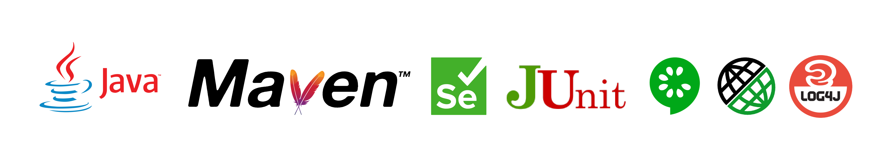

# YFrameworkFinalC15
#### This is a hybrid test automation framework designed for UI, API, and Database testing. It incorporates Data Driven, Keyword Driven, and Behavior Driven Development approaches.



## Overview
The framework aims to be versatile and adaptable for various testing needs. 
It's designed to be scalable and reliable, implementing various design patterns such as 
Page Object Model (POM), 
PageFactory, 
and Singleton. 
The framework includes a library of reusable utility classes and methods, facilitating the BDD approach with Cucumber. 
Configuration is centralized in `config.properties` for convenience. 
Key technologies and tools include 
Java, Maven, Selenium, JUnit, RestAssured, Cucumber, JavaFaker, WebDriverManager, Log4J, along with capabilities to read from Excel files, connect with databases, and more.

## Getting Started
These instructions will guide you in setting up the project on your local machine for development and testing purposes.

- **Accepting the GitHub Invitation:**
    - You will receive an invitation email from yollinfo. Check your spam folder if it's not in the inbox. Accept the invitation to access the GitHub repository.

- **Forking the Project:**
    - Navigate to the top-right corner of the GitHub repository page and click on "Fork".
    - This will create a copy of the project in your GitHub account.

- **Cloning the Project:**
    - After forking, go to "Clone" and copy the repository link.
    - Open IntelliJ IDEA (or your preferred IDE), select "Projects", and use the "Get from Version Control" option.
    - Paste the repository link and clone the project onto your local machine.

- **Project Setup:**
    - Once the project is cloned, open the terminal in IntelliJ IDEA (or your IDE) and run:
      ```bash
      mvn clean install
      ```
    - To verify the setup, try running a TestRunner class to see the test automation in action.

### Prerequisites
Ensure you have the following software installed:
- Java (recommend version 8 or newer)
- Maven (3.6.3 or newer)
- IntelliJ IDEA or another IDE of your choice

### Installing
Follow the above "Getting Started" steps for a complete guide on setting up your environment.

## Running the Tests
- To run the tests, navigate to the `src/test/java` directory, find the TestRunner classes and run them as JUnit tests.
- `APITestRunner`
- `UITestRunner`
- _This can be done directly from your IDE. Also, you can run following commands:_
- `mvn clean test -Dtest=UITestRunner`
- `mvn clean test -Dtest=APITestRunner`
- _Run the with different browsers_
- `mvn clean test -Dtest=UITestRunner -Dbrowser=chrome`
- `mvn clean test -Dtest=UITestRunner -Dbrowser=chrome-headless`
- `mvn clean test -Dtest=UITestRunner -Dbrowser=chromeRemote`
- `mvn clean test -Dtest=UITestRunner -Dbrowser=firefoxRemote`
- `mvn clean test -Dtest=UITestRunner -Dbrowser=safari`
- `mvn clean test -Dtest=UITestRunner -Dbrowser=edge`
## Project execution in Jenkins should have below mvn command
- `mvn clean verify -Dtest=UITestRunner -Dbrowser=chromeRemote -Dcucumber.options="--tags @regression"`

## Structure
The project is structured as follows:
- `src/test/java`: Contains the test code, including step definitions and test runners.
- `src/test/resources`: Contains test resources like feature files and configuration properties.
- `log`: Contains log files generated during test execution.

## Built With
- [Java](https://www.java.com/) - Programming language
- [Maven](https://maven.apache.org/) - Dependency Management and build automation
- [Selenium WebDriver](https://www.selenium.dev/) - Web Automation Framework
- [JUnit](https://junit.org/) - Unit Testing Framework
- [RestAssured](https://rest-assured.io/) - Testing and validating REST services
- [Cucumber](https://cucumber.io/) - BDD Framework
- [JavaFaker](https://github.com/DiUS/java-faker) - Library for generating fake data
- [WebDriverManager](https://github.com/bonigarcia/webdrivermanager) - Automatic management of WebDriver binaries
- [Log4J](https://logging.apache.org/log4j/2.x/) - Logging utility
- Additional tools and libraries for Excel operations, database connectivity, etc.

## Contributing
To contribute to this project:
1. Fork the project.
2. Create a new feature branch (`git checkout -b feature/YourAmazingFeature`).
3. Commit your changes (`git commit -m 'Add YourAmazingFeature'`).
4. Push to the branch (`git push origin feature/YourAmazingFeature`).
5. Open a pull request.